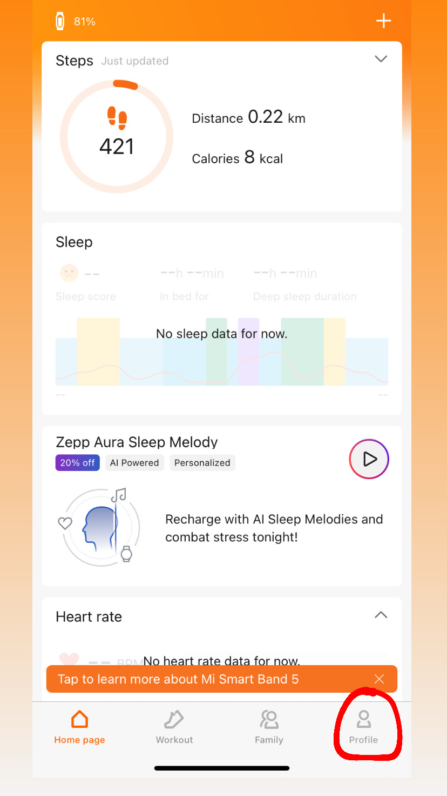
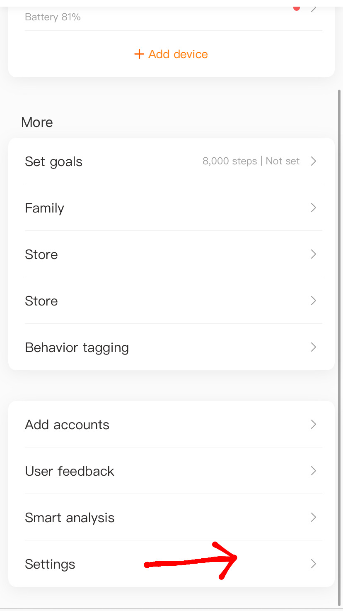
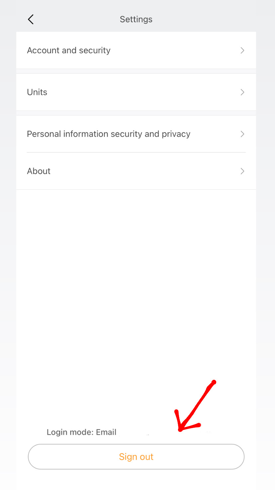

## Set Up Device
### Sign Out of Previous Account
- Click `Profile`
- Click `Settings`
- Click `Sign Out`

   
   
   

 

 

<!--  -->

## Download data
- Go to [api-mifit.huami.com/t/account_mifit](api-mifit.huami.com/t/account_mifit)
- Click `Export Data`
- Log in with Zepp Life _email_ and _password_
- Click `Export Data`
- “Exporting data will increase risk of data loss. Continue anyway?” —> Click `Ok`
- Select all options 
    -  
- Select Date Range (last 30 days) —> Click `Ok`
- Enter my email: anvay.bhanap@gmail.com
- Enter CAPTCHA
