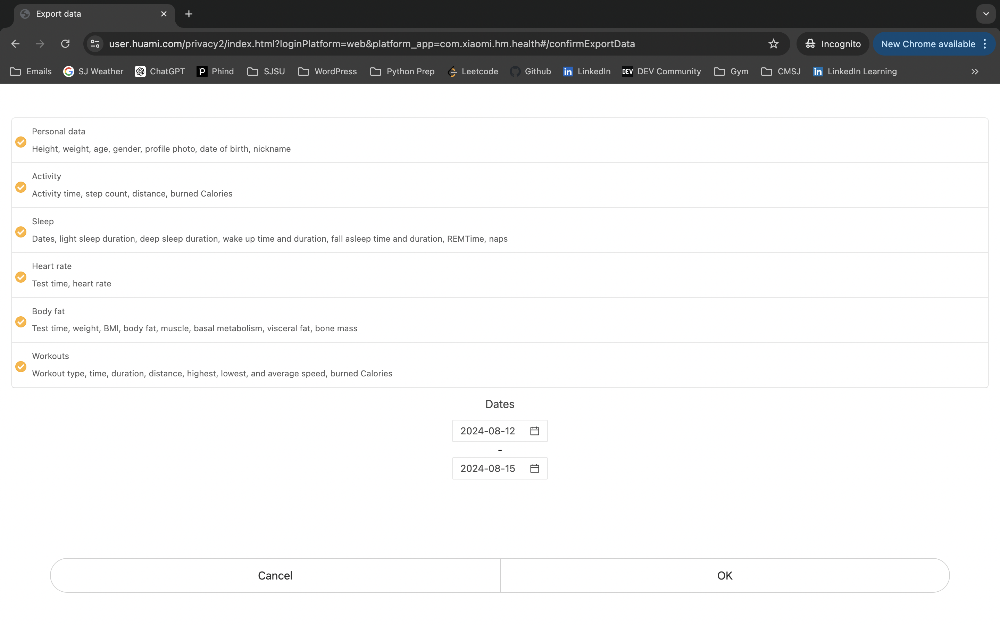

<h2 style="color: orange"><u>Instructions for Others</u></h2>

## Set Up Device
### Sync and Sign Out of Previous Account

- Hold Watch near phone and pull down on screen to `Sync Device`

   
   
   

 

 

- Click `Profile`
- Click `Settings`
- Click `Sign Out`

   
   
   

 

 

<!-- potneital need to sync devices when charging
if theyre taking off the watches when dancing, we can have the watches be synced during that time
all the watches should have some indication of who they belong to -->

<h2 style="color: lightblue"><u>Instructions for Me</u></h2>

## Download data
- Go to [api-mifit.huami.com/t/account_mifit](https://user.huami.com/privacy2/index.html?loginPlatform=web&platform_app=com.xiaomi.hm.health&v=4.0.17#/)
- Click `Export Data`

- Log in with Zepp Life _email_ and _password_

- Click `Export Data`

- “Exporting data will increase risk of data loss. Continue anyway?” —> Click `Ok`

- Select all options 
    - Personal Data
    - Activity
    - Sleep
    - Heart Rate
    - Body Fat
    - Workouts 
- Select Date Range (last 30 days) —> Click `Ok`

- Enter email: anvay.bhanap@gmail.com
- Enter CAPTCHA

- Check email for downloadable data

[Quick Access Email](https://mail.google.com/mail/u/0/#inbox)
